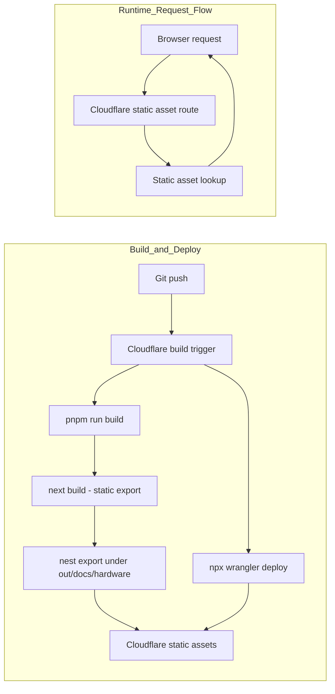

# Hardware Docs

Documentation site for [Abstract Machines Hardware](https://github.com/absmach/s0), built with [Fumadocs](https://fumadocs.dev) and Next.js.

The site is served under `/docs/hardware/`.

## Development

```bash
pnpm install
pnpm dev
```

Open http://localhost:3000/docs/hardware/ with your browser to see the result.

## Deployment

This site uses:

- **Next.js static export** — `next build` outputs static files to `out/`
- **Next.js `basePath`** — generates links and assets under `/docs/hardware`
- **Post-build nesting** — `scripts/nest-static-export.mjs` moves the export under `out/docs/hardware/` so Cloudflare static assets can serve it from the route prefix without custom Worker code

### Cloudflare build settings (Dashboard)

| Setting          | Value                         |
|------------------|-------------------------------|
| Build command    | `pnpm run build`              |
| Deploy command   | `npx wrangler deploy`         |
| Version command  | `npx wrangler versions upload` |
| Root directory   | `/`                           |

### Architecture



## Environment Variables

Only one build variable is needed:

```env
NEXT_PUBLIC_BASE_URL=https://www.absmach.eu/docs/hardware
```

Set this as a Cloudflare build variable so it is embedded into the static output at build time.

## Project structure

| Path                                   | Description                              |
|----------------------------------------|------------------------------------------|
| `src/app/[[...slug]]/page.tsx`         | Docs page renderer (all routes)          |
| `src/app/api/search/route.ts`          | Static search index route handler        |
| `src/app/og/[...slug]/route.tsx`       | OG image generation for docs pages       |
| `src/app/llms-full.txt/route.ts`       | LLM-readable full docs text              |
| `content/docs`                         | MDX source files                         |
| `src/lib/source.ts`                    | Fumadocs source adapter                  |
| `src/lib/layout.shared.tsx`            | Shared layout options (nav, logo)        |
| `scripts/nest-static-export.mjs`       | Moves static export under `/docs/hardware` |

## Learn More

- [Fumadocs](https://fumadocs.dev)
- [Next.js Documentation](https://nextjs.org/docs)
