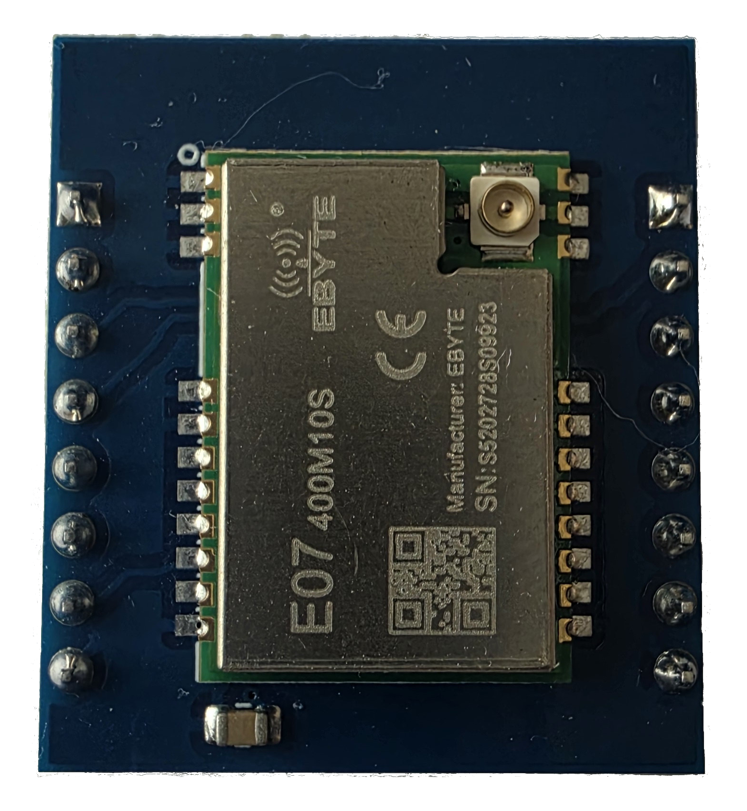
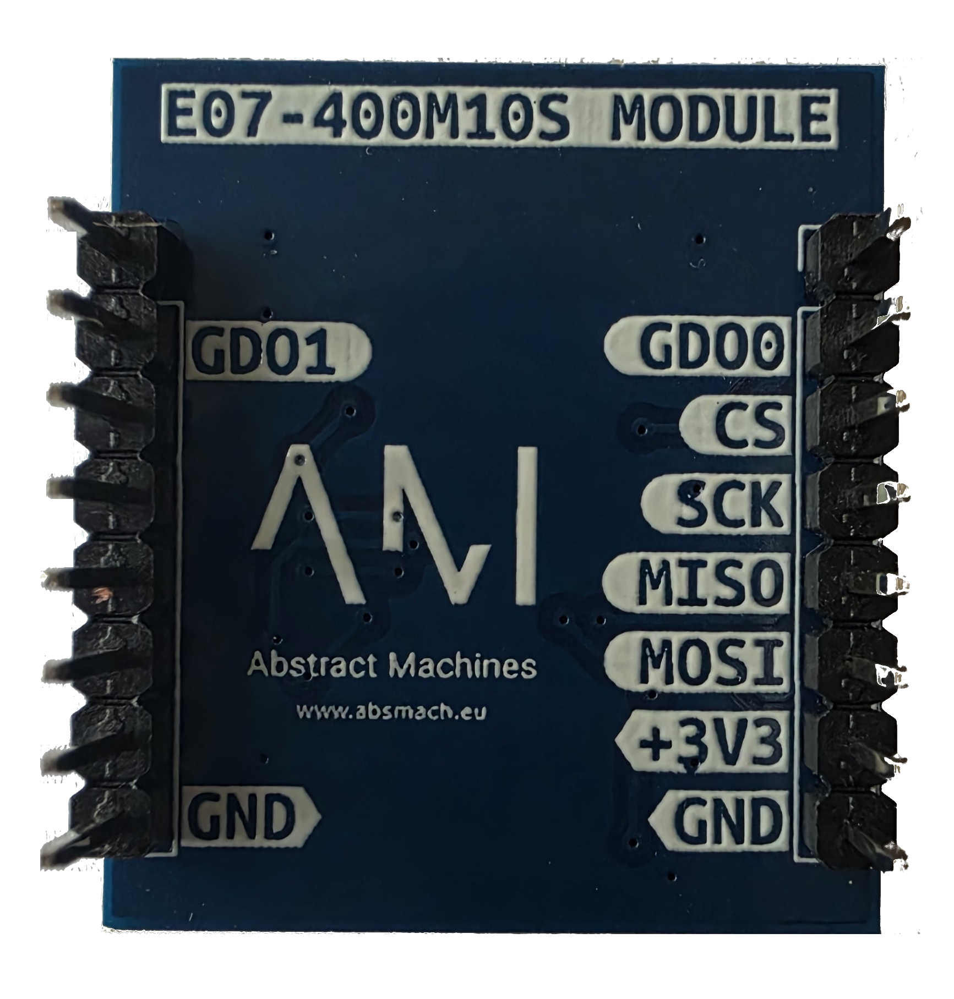

# E07-400M10S

Sub-GHz radio based on the **EBYTE E07-400M10S** (TI CC1101, LCSC `C2965513`) — 400 MHz, +10 dBm. Plugs into A0 **BUS1 or BUS2**, slot-interchangeable with the WMBUS module.

## Key Features

- 400 MHz, 2-FSK/GFSK/ASK/OOK/MSK, up to +10 dBm
- SPI: same SCK/MISO/MOSI/CS as WMBUS (GPIO20/19/18/2); GDO0→GPIO1, GDO1→GPIO0
- 1.8–3.6 V from slot +3V3; reset purely over SPI (SRES strobe, no reset pin)

## Image

### Front PCB

### Back PCB

### Front Pinout

### Back Pinout

## Bring-up

[E07-400M10S Sub-GHz](../tests/e07-400m10s) — expect `PARTNUM = 0x00`, `VERSION = 0x14`, `MARCSTATE = 0x01 (IDLE)`.

## Schematics & Sources

- Schematic (PDF) — [GitHub](https://github.com/absmach/a0/blob/main/modules/E07400M10S/schematic.pdf)
- KiCad source — [E07400M10S.kicad_sch](https://github.com/absmach/a0/blob/main/modules/E07400M10S/E07400M10S.kicad_sch)
- Module README — [GitHub](https://github.com/absmach/a0/blob/main/modules/E07400M10S/README.md)

## References

- TI CC1101 — [product page](https://www.ti.com/product/CC1101) · [datasheet (PDF)](https://www.ti.com/lit/ds/symlink/cc1101.pdf)
- E07-400M10S — [LCSC C2965513](https://www.lcsc.com/product-detail/C2965513.html) · [datasheet (PDF)](https://www.lcsc.com/datasheet/C2965513.pdf)
