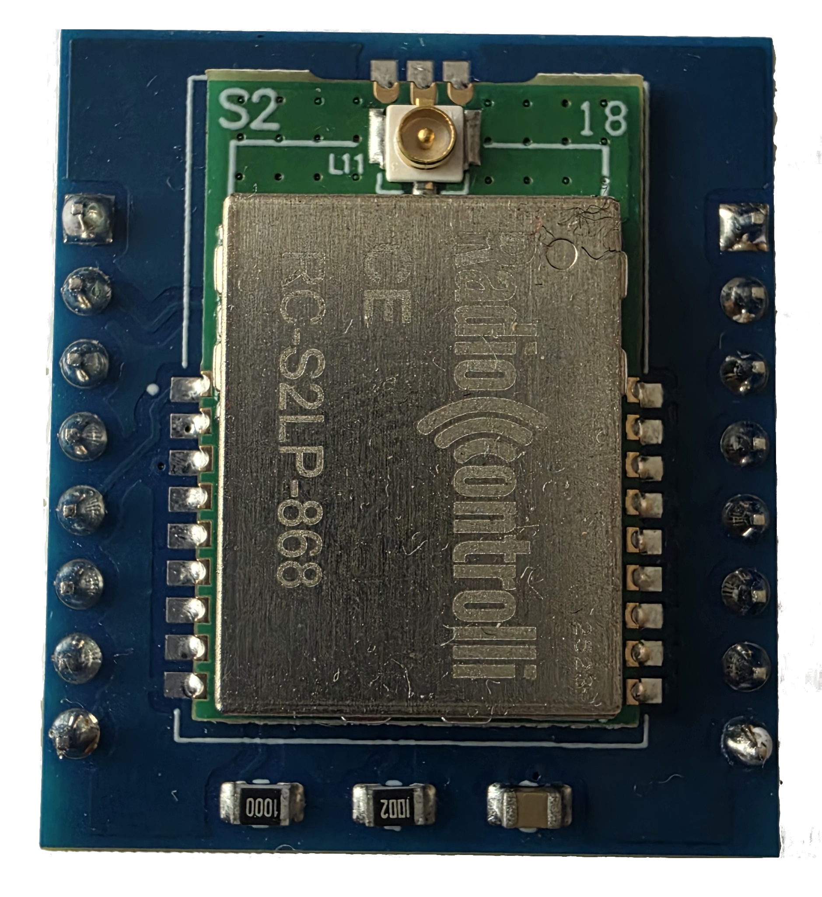
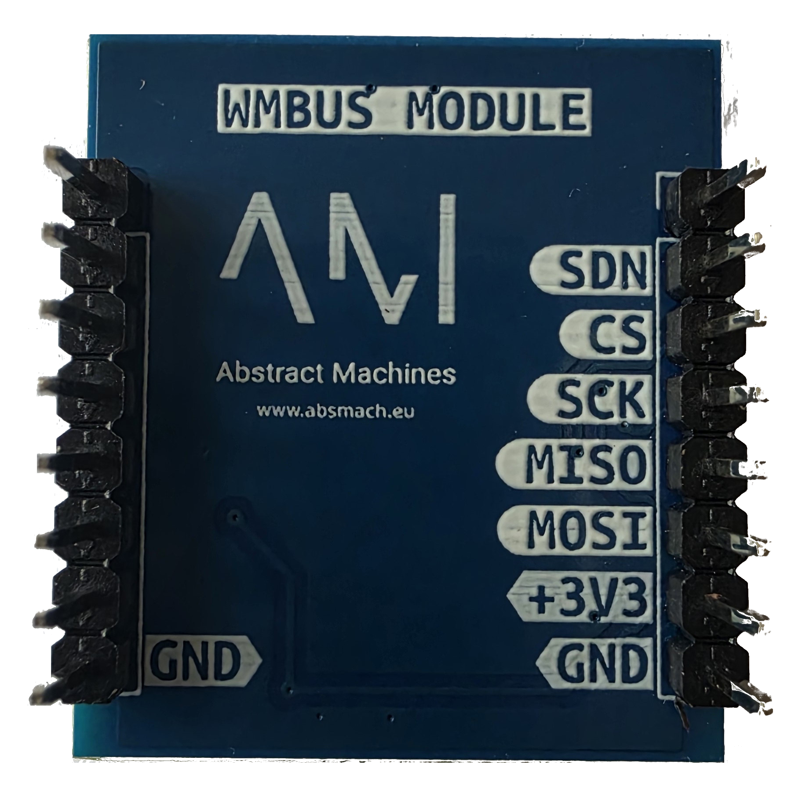

# WMBUS

Wireless M-Bus metering radio based on the **Radiocontrolli RC-S2LP-868** (ST S2-LP, 868 MHz) for reading heat, water, gas, and electricity meters. Plugs into A0 **BUS1 or BUS2**, SPI to the ESP32-C6, powered from the slot (+3V3).

## Key Features

- Wireless M-Bus (EN 13757-4), 868 MHz ISM
- SPI: SCK GPIO20 / MISO GPIO19 / MOSI GPIO18, CS GPIO2, SDN GPIO1 (BUS1)
- 1.8–3.6 V — power from J1 pin 7 (+3V3), never J3 pin 7 (FB_5V)

## Image

### Front PCB

### Back PCB

### Front Pinout

### Back Pinout

## Bring-up

[Wireless M-Bus Testing](../tests/wireless-mbus) — reset via SDN + SRES strobe, confirm `PARTNUM = 0x03`.

## Schematics & Sources

- Schematic (PDF) — [GitHub](https://github.com/absmach/a0/blob/main/modules/wmbus/schematic.pdf)
- KiCad source — [wmbus.kicad_sch](https://github.com/absmach/a0/blob/main/modules/wmbus/wmbus.kicad_sch)
- Module README — [GitHub](https://github.com/absmach/a0/blob/main/modules/wmbus/README.md)

## References

- ST S2-LP — [product page](https://www.st.com/en/wireless-connectivity/s2-lp.html) · [datasheet (PDF)](https://www.st.com/resource/en/datasheet/s2-lp.pdf)
- RC-S2LP-868 — [product page](https://www.radiocontrolli.com/en/radio-modules-868mhz/rc-s2lp-868/)
- OMS / EN 13757-4 — [specification](https://oms-group.org/)
