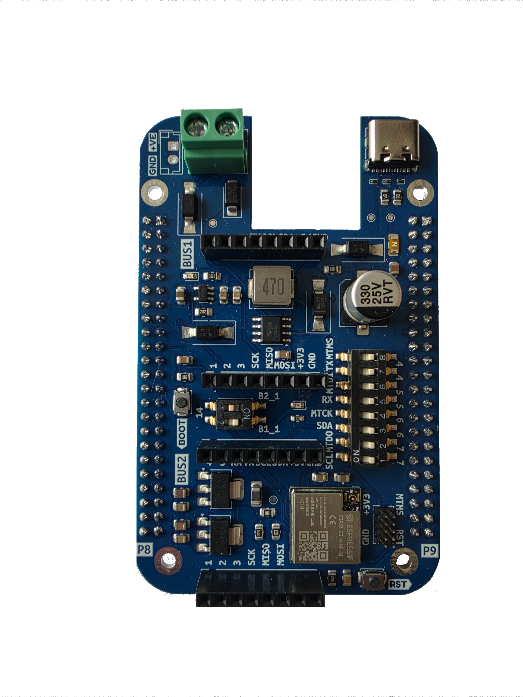
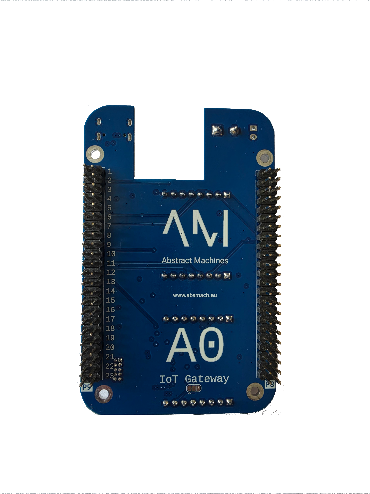

# A0

The **A0** is the base board of the modular IoT gateway — an **ESP32-C6-MINI-1/U** carrier (RISC-V, Wi-Fi 6, Bluetooth 5 LE, 802.15.4) that pushes all radio/cellular connectivity onto plug-in [modules](./modules).

## Key Features

- ESP32-C6 module on top — compute + Wi-Fi 6 / BLE / 802.15.4, secure boot, flash encryption, TEE
- Power: USB-C input, external supply input, battery with charging (pair of AMS1117-3.3 LDOs → +3V3 rail)
- Expansion: two module slots, **BUS1 (J1+J3)** and **BUS2 (J4+J2)**, each 2× 8-pin headers
- Native USB-Serial/JTAG for flashing and logging

## Image

### Front PCB

### Back PCB

### Front Pinout

### Back Pinout

## Schematics & Sources

- Schematic (PDF) — [GitHub](https://github.com/absmach/a0/blob/main/a0/schematic.pdf)
- KiCad sources — [a0.kicad_sch](https://github.com/absmach/a0/blob/main/a0/a0.kicad_sch) · subsheets `esp32-c6`, `power`, `expansion`, `sim7080G`, `wmbus`
- Board README — [GitHub](https://github.com/absmach/a0/blob/main/a0/README.md)

## References

- ESP32-C6 — [product page](https://www.espressif.com/en/products/socs/esp32-c6) · [datasheet (PDF)](https://www.espressif.com/sites/default/files/documentation/esp32-c6_datasheet_en.pdf)
- Bring-up — [ESP32-C6 Boot Recovery](../tests/esp32-c6)
