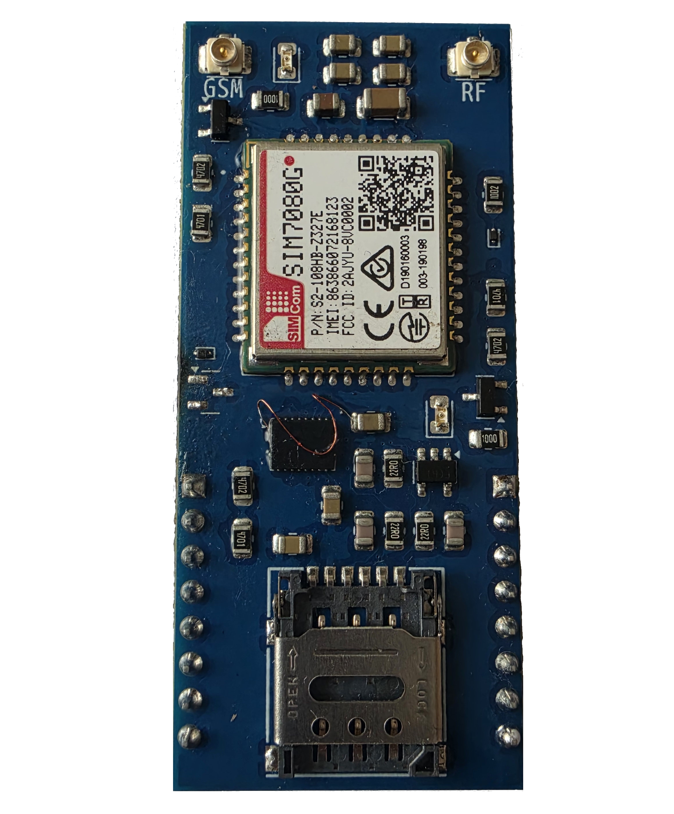
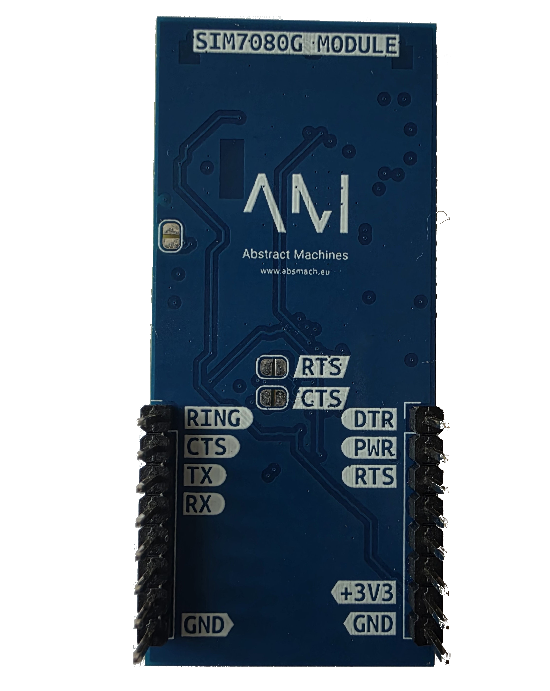

# SIM7080G

Cellular uplink module based on the **SIMCom SIM7080G** — **NB-IoT / LTE-M (Cat-M)** plus **GNSS** (GPS/GLONASS/BeiDou/Galileo). Plugs into A0 **BUS1 or BUS2**, controlled over UART with AT commands.

## Key Features

- NB-IoT and LTE-M (Cat-M) cellular uplink
- GNSS positioning for asset tracking
- Dedicated RF + GNSS antenna connectors
- Powered from the expansion slot

## Image

### Front PCB

### Back PCB

### Front Pinout

### Back Pinout

## BUS1 Wiring (verified)

| Signal            | ESP32-C6     | BUS1 Pin                            |
| ----------------- | ------------ | ----------------------------------- |
| Modem TX → ESP RX | GPIO16       | J3 pin 3                            |
| Modem RX ← ESP TX | GPIO17       | J3 pin 4                            |
| PWRKEY            | GPIO1        | J1 pin 2                            |
| RING              | GPIO3        | J3 pin 1                            |
| CTS               | GPIO0        | J3 pin 2                            |
| RTS/DTR           | GPIO2/GPIO14 | J1 pin 3 / J1 pin 1 (via U1 switch) |
| VCC/GND           | +3V3/GND     | J1 pin 7 / J3 pin 8                 |

UART @115200 baud. Bring-up firmware in `firmware/`: `a0_sim7080g`, `a0_sim7080g_pwrkey`, `a0_sim7080g_bringup`, `a0_sim7080g_term`.

## Schematics & Sources

- Schematic (PDF) — [GitHub](https://github.com/absmach/a0/blob/main/modules/sim7080g/schematic.pdf)
- KiCad source — [sim7080g.kicad_sch](https://github.com/absmach/a0/blob/main/modules/sim7080g/sim7080g.kicad_sch)
- Module README — [GitHub](https://github.com/absmach/a0/blob/main/modules/sim7080g/README.md)

## References

- SIMCom SIM7080G — [product page](https://www.simcom.com/product/SIM7080G.html)
